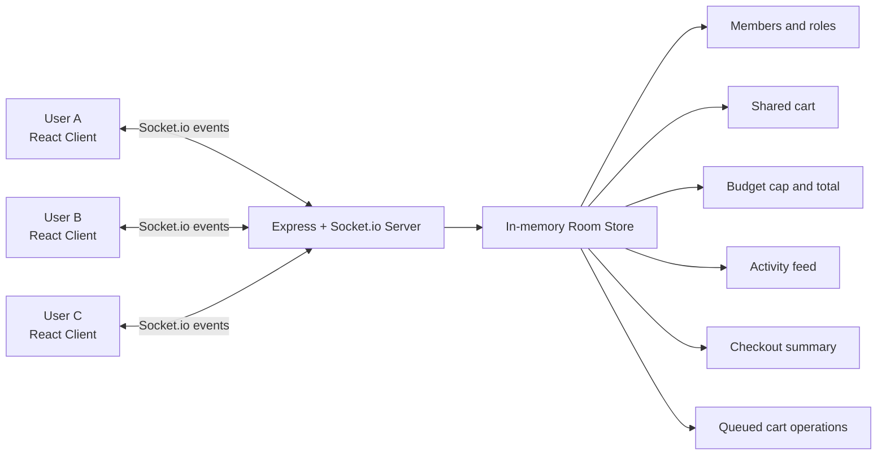

# Collaborative Shopping System

A real-time collaborative shopping app where one user creates a session, other users join with a room code, and everyone updates the same cart live. The project is built for a hackathon demo and uses a React frontend with a Node.js + Socket.io backend.

## Tech Stack

- Frontend: React, Vite, Tailwind CSS, Socket.io Client
- Backend: Node.js, Express, Socket.io
- State management: server-authoritative in-memory room state

## System Architecture Diagram



## How The System Works

1. A user creates a room and gets a 6-character session code.
2. Other users join the same room using that code.
3. Cart changes are sent to the backend through Socket.io events.
4. The backend updates the authoritative room state.
5. The backend broadcasts the updated room state back to every client in that session.

## Conflict Resolution Strategy Chosen

This project uses **server-authoritative additive/subtractive cart updates with a per-room queue**.

### Why this strategy was chosen

- Clients send item deltas such as `+1` or `-1` instead of sending full absolute quantities.
- The backend processes updates one at a time in a room-specific queue.
- Each update is applied against the latest server state, not stale client state.
- This avoids race conditions when multiple users click on the same item at nearly the same time.
- It is simple, deterministic, and a strong fit for a hackathon project without adding database locking or distributed coordination.

### Example

- If the current quantity of apples is `2`
- User A clicks `+1`
- User B clicks `-1` at nearly the same time
- The backend queue processes both updates sequentially
- The final quantity stays consistent because the server is the source of truth

## Role Enforcement Approach

The app supports two roles:

- `owner`
- `contributor`

Role enforcement is handled on the backend, not only in the frontend UI.

### Owner-only actions

- Change the shared budget
- Remove a contributor
- Trigger checkout
- Close the session

### Why this approach was chosen

- Frontend-only restrictions are not secure because users can manually emit socket events from the browser.
- The backend checks whether the active socket matches the room owner before allowing privileged actions.
- Unauthorized attempts are rejected without mutating shared state.

This ensures contributors cannot bypass the interface and perform owner-only actions.

## Core Realtime Features

- Create a collaborative session with a room code
- Join the same session from multiple users
- Update cart items live for all connected users
- Show shared budget progress in real time
- Display activity feed updates instantly
- Complete checkout from the owner account

## Known Limitations

- Room data is stored only in memory, so sessions are lost when the backend restarts or redeploys.
- Session codes are temporary and cannot be reused after a server restart.
- The product catalog is mocked and not backed by a database.
- There is no full authentication system beyond display names and active socket membership.
- Owner reassignment after disconnect is basic and promotes the next remaining member.
- There is no persistent order history after the session ends.

## Project Structure

```text
project collaborative shopping system/
|-- backend/
|   |-- .env.example
|   |-- package.json
|   `-- server.js
|-- frontend/
|   |-- .env.example
|   |-- package.json
|   |-- vite.config.js
|   `-- src/
|       |-- App.jsx
|       |-- components/
|       |-- context/
|       `-- data/
`-- README.md
```

## How To Run The Project Locally

### Prerequisites

- Node.js 18 or later
- npm

### 1. Clone the repository

```bash
git clone <your-repository-url>
cd "project collaborative shopping system"
```

### 2. Create local environment files

Backend:

```bash
cd backend
copy .env.example .env
```

Frontend:

```bash
cd frontend
copy .env.example .env
```

### 3. Install dependencies

Backend:

```bash
cd backend
npm install
```

Frontend:

```bash
cd frontend
npm install
```

### 4. Start the backend

```bash
cd backend
npm run dev
```

### 5. Start the frontend

```bash
cd frontend
npm run dev
```

### 6. Open the app

Visit `http://localhost:5173` in your browser.

To test collaboration:

- Create a session in one tab
- Copy the generated room code
- Join the same room from another tab or device

## Environment Variables

Backend:

- `PORT=4000` for local development
- `CLIENT_URL=http://localhost:5173`

Frontend:

- `VITE_SOCKET_URL=http://localhost:4000`

## Summary

This repository includes the required README sections:

- System architecture diagram
- Conflict resolution strategy chosen and why
- Role enforcement approach
- Known limitations
- Local setup and run instructions
